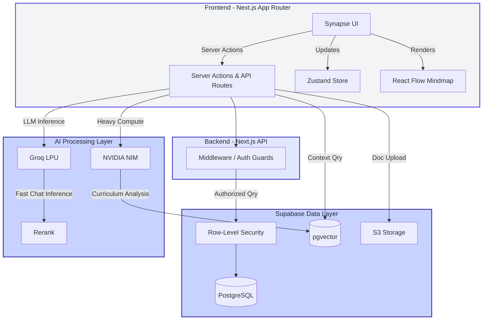
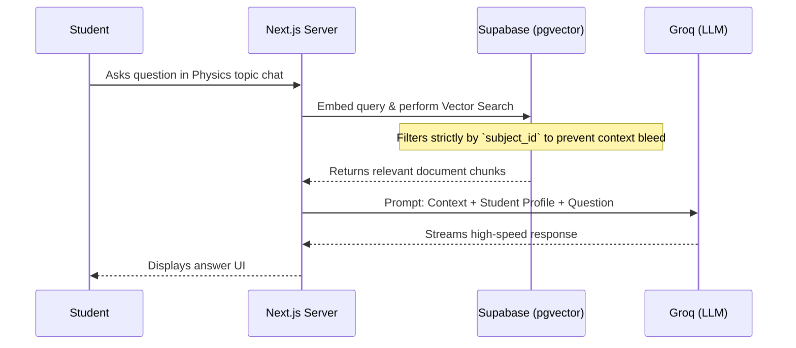

# Synapse 🧠

Synapse (formerly MindMapClass) is a multi-tenant academic progress platform that reimagines learning via progress tracking and visualization. Designed to bridge the gap between "what a teacher teaches" and "what a student learns", Synapse combines Google Classroom's role management with an interactive and pannable mindmap visualization. 

## 🌟 Core Value
Students and teachers can view their entire curriculum journey as a living, interactive mindmap—making academic progress tangible, visual, and engaging, similar to unlocking a skill tree in a game!

## 🚀 Key Features (In Development)

- **Multi-tenant Architecture:** Completely isolated workspaces for distinct schools or institutions.
- **Role-based Access:** Dedicated spaces and workflows for Admins, Teachers, and Students.
- **Interactive Mindmap Canvas:** A pannable and zoomable visual view of courses where nodes represent chapters and sub-topics.
- **Game-like Progression Tracking:** Watch nodes change state (locked → upcoming → in-progress → completed) to reflect learning progress.
- **Dual Tracking:** Progress measured from the Teacher's delivery versus the Student's actual understanding.
- **AI-Powered Learning Assistant:** Context-aware, subject-scoped AI chat powered by Groq and NVIDIA NIM using RAG over uploaded curriculum resources. 
- **Teacher & Admin Dashboards:** Actionable analytics, heatmaps, and silent engagement tracking without friction for students.

## 🛠 Tech Stack

- **Framework:** Next.js 15 (App Router, Turbopack)
- **Database & ORM:** PostgreSQL + Prisma
- **Authentication:** Supabase Auth (SSR)
- **UI & Styling:** Tailwind CSS v4, Framer Motion, Shadcn UI
- **State Management:** Zustand
- **Canvas / Mindmap:** React Flow (or D3.js)
- **AI Backend:** Groq & NVIDIA NIM

## 🏗️ Architecture & End-to-End Flow

Synapse is built as a monolithic Next.js application, leveraging Supabase as a fully managed backend for authentication, database (PostgreSQL), vector storage (pgvector), and file storage. The architecture is explicitly designed for a **multi-tenant environment** (i.e. different schools and institutions) managed via Row-Level Security (RLS) on the data layer.

### High-Level System Architecture



### End-to-End Workflow Explained

1. **Multi-Tenant Onboarding (The Foundation)**
   Institutions are modeled as separate tenants. A Super Admin creates an institution, then an Institution Admin adds Teachers and Students (either via direct CSV upload or ad-hoc join codes). Supabase's Row-Level Security ensures that queries are automatically scoped so that data from one school never leaks into another.

2. **Curriculum Generation (Teacher Flow)**
   Teachers create **Batches** (e.g., "Physics 101 - Fall") and define subjects. Rather than a flat list of chapters, the teacher constructs a curriculum using a **Node-based Mindmap Canvas** powered by React Flow. They can structure the syllabus dynamically, attaching PDF resources, links, and assignments directly onto specific nodes. NVIDIA's NIM microservices can optionally step in to auto-sequence topics into a logical progression tree based on uploaded syllabus documents.

3. **Learning & Gameplay (Student Flow)**
   Students access their dashboard and see the subject mindmap laid out like a game's skill tree. Topics start as **Locked** (`🔒`). As the class moves forward, the teacher unlocks them (`⬜ Upcoming`). Students study the attached materials on a topic and—once understood—mark it as **In-Progress** (`🟡`) or **Completed** (`✅`). This visual gamification (accruing XP and badges per node) replaces traditional, boring assignment charts.

4. **The "Engagement Gap" and Analytics (Data Flow)**
   Because progression is logged directly via the mindmap UI, Synapse compares *where the Teacher thinks the class is* vs. *where individual Students actually are*. Synapse silently tracks passive signals (logins, resource view duration, node clicks) to place students in engagement tiers (🟢 Progressing, 🟡 Stuck, 🔴 Inactive), generating a heatmap for the teacher without asking students for annoying feedback surveys.

### AI RAG (Retrieval-Augmented Generation) Pipeline

When a student clicks on a difficult node and opens the Chat Assistant, the AI doesn't just use general knowledge. It uses **Retrieval-Augmented Generation** scoped strictly to that specific subject's resources.



This ensures that the AI only relies on the teacher's approved syllabus, maintaining academic integrity and keeping the assistant's advice firmly within the curriculum boundaries.

## 🏃 Getting Started

### Prerequisites
- Node.js & [Bun](https://bun.sh/)
- A [Supabase](https://supabase.com/) project
- PostgreSQL database

### Installation

1. Clone the repository:
   ```bash
   git clone https://github.com/pantha704/synapse.git
   cd synapse
   ```

2. Install dependencies via bun:
   ```bash
   bun install
   ```

3. Configure your environment variables in `.env.local`:
   ```env
   NEXT_PUBLIC_SUPABASE_URL=your_supabase_project_url
   NEXT_PUBLIC_SUPABASE_ANON_KEY=your_supabase_anon_key
   ```

4. Run the development server:
   ```bash
   bun run dev
   ```

5. Access the application running locally at [http://localhost:3000](http://localhost:3000).

---

*Built for hackathons, designed for academic excellence.*
